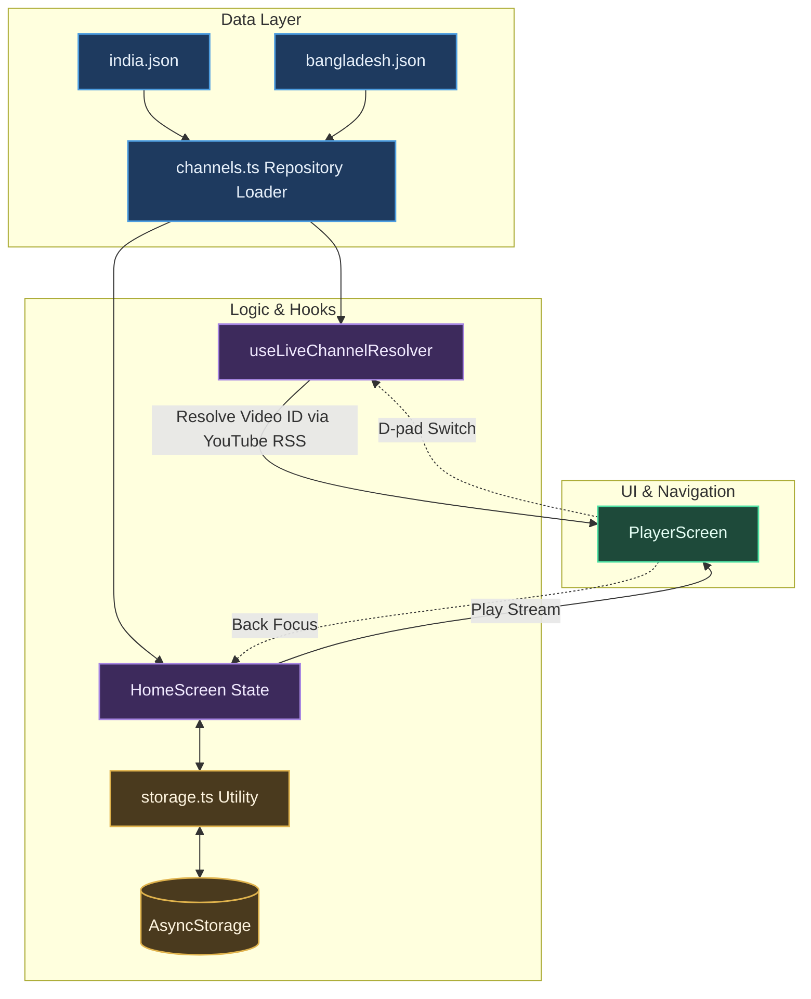

# TV-NewsHub

<p align="center">
  
</p>

<p align="center">
  <strong>A premium, open-source, dark-themed Android TV aggregator of live news channels. Built for the 10-foot viewing experience.</strong>
</p>

<p align="center">
  <a href="https://reactnative.dev/"></a>
  <a href="https://www.typescriptlang.org/"></a>
  
  <a href="https://developer.android.com/tv"></a>
  <a href="LICENSE"></a>
  <a href="SECURITY.md"></a>
</p>

---

NewsHub is a dedicated smart TV application designed from the ground up for remote-controlled interfaces. It aggregates live news streams by country and language, resolving active YouTube live stream IDs dynamically via YouTube's RSS feed API and playing them inline using an embedded player — ensuring users enjoy a seamless, full-screen viewing experience without ever leaving the application.

This repository is **exclusively optimized for Android TV, Google TV, Fire TV, and other Android-based smart TVs**. All native iOS modules, configurations, and CocoaPods files have been completely stripped out to ensure a lean, lightweight, and focused codebase.

---

## Features & TV OS UI Highlights

*   **Optimized 10-Foot Focus & Zoom**:
    Focusable items (channel cards, country pills, language tabs) scale up by `1.05x` and draw a bold white border on focus. Large type sizes and high-contrast layouts ensure readability from a distance of 10 feet.
*   **Country & Language Filtering**:
    Dynamically loads and groups channels based on country directories (e.g., India, Bangladesh) and provides language tabs (e.g., Bengali, All) corresponding to active channels.
*   **Live Clock & Status Badges**:
    Features an active digital clock on the home dashboard. Displays clean "OFFLINE" badges on tiles if live streams fail to resolve or go offline.
*   **Last-Watched Auto-Resume**:
    Persists your last-viewed channel and timestamp via AsyncStorage. If you reopen the app within **10 minutes**, it bypasses the dashboard and opens the live stream immediately.
*   **Immersive Player Overlay**:
    Smoothly fades out stream controls and channel details after **4 seconds** of inactivity (`300ms` fade-out) for distraction-free viewing. Pressing any remote D-pad key instantly fades the overlay back in (`200ms` fade-in) and resets the timer.
*   **D-Pad Channel Hopping**:
    While in full-screen playback, press **Left/Right D-pad keys** to hop between adjacent channels within the active filter list instantly, without exiting to the dashboard.
*   **Back Button Focus Target**:
    Exiting the player returns the user to the home screen grid with focus landed directly on the tile of the channel they were just watching.
*   **Cookie-Consent Auto-Dismiss**:
    Automatically accepts YouTube's cookie-consent dialog inside the embedded WebView before video playback begins, ensuring users never encounter a blocking consent screen.

---

## Architecture & Data Flow

NewsHub uses the **Repository Pattern** to separate the user interface from the data layer. This makes it easy to swap out the local JSON configurations for a remote database (like Firebase Firestore or Remote Config) in the future without changing any component logic.



---

## Tech Stack

*   **Framework**: [react-native-tvos](https://github.com/react-native-tvos/react-native-tvos) (TV-specific fork of React Native)
*   **Navigation**: `@react-navigation/native` with `@react-navigation/native-stack`
*   **Video Engine**: `react-native-youtube-iframe` (safely wraps YouTube IFrame Player API in `react-native-webview`)
*   **Data Layer**: Custom static JSON repository loader — channels verified via YouTube RSS API
*   **Testing**: Jest + `react-test-renderer` with fully mocked native dependencies
*   **Type System**: TypeScript

---

## Project Structure

```text
TV-NewsHub/
├── android/                   # Native Android TV build configurations & resources
├── APK_Export/                # Pre-built release APKs (arm64, armeabi-v7a, universal)
├── docs/                      # Technical documentation
│     ├── Build.md             # Setup, compiler guidelines, & run commands
│     ├── Architecture.md      # Repository patterns, hooks, and D-pad lifecycle
│     └── Design.md            # Typography scale, focus indicators, & animation tokens
├── public/                    # Branding assets (TV banner, antenna-icon.svg)
├── src/                       # Application source files
│     ├── components/          # D-pad focusable components (ChannelTile, Pills, Overlays)
│     ├── data/                # Repository pattern loaders
│     │     ├── countries/     # Country-based channel lists (india.json, bangladesh.json)
│     │     └── channels.ts    # Static registry and dynamic export mapper
│     ├── hooks/               # useLiveChannelResolver and useIdleTimer hooks
│     ├── navigation/          # Stack navigation configuration
│     ├── screens/             # HomeScreen (grid dashboard) & PlayerScreen (inline video)
│     └── utils/               # AsyncStorage persistence layer
└── __tests__/                 # Unit tests (App.test.tsx)
```

---

## Getting Started

### 1. Prerequisites
Ensure you have the Android SDK configured on your machine. Set up an Android TV or Google TV Emulator profile and verify it is running:
```bash
adb devices
```

### 2. Installation
Install the project dependencies:
```bash
npm install
```

### 3. Start the Metro Bundler
Start Metro in the terminal:
```bash
npm start
```

### 4. Compile & Launch (Android TV)
In a new terminal window, compile the app and deploy it onto your active TV emulator/device:
```bash
npm run android
```

---

## Running Unit Tests

We use Jest for unit testing. Mocks for React Navigation, AsyncStorage, WebView, and the native video player are pre-configured inside `jest.setup.js`.

To run the tests:
```bash
npm test
```

---

## Building Production APKs

Compile all release APK variants (arm64-v8a, armeabi-v7a, x86, x86_64, universal):

```bash
# Windows
cd android
gradlew.bat assembleRelease

# macOS / Linux
cd android
./gradlew assembleRelease
```

Compiled APKs are located at:
```
android/app/build/outputs/apk/release/
  app-arm64-v8a-release.apk    — Modern physical Android TV devices
  app-armeabi-v7a-release.apk  — Older physical Android TV devices
  app-x86-release.apk          — x86 emulators
  app-x86_64-release.apk       — x86_64 emulators
  app-universal-release.apk    — All architectures (use for emulators)
```

Pre-built APKs for each release are also available in the [`APK Export/`](./APK Export/) folder.

---

## How to Boot Emulator & Install APKs

### 1. List Available Virtual Devices (AVDs)

List all configured Android TV emulators on your machine:
```bash
emulator -list-avds
# Example output:
# TV_4K
```

### 2. Boot & Launch the Virtual Emulator

Launch your target Android TV emulator GUI directly using Command Prompt (`cmd`) or Terminal:

```cmd
:: Standard Launch (Command Prompt)
start emulator -avd TV_4K

:: Cold Boot (Bypasses stale snapshots)
start emulator -avd TV_4K -no-snapshot-load
```

> **Note (Windows CMD):** Using `start` opens the emulator GUI in a standalone foreground window without locking your terminal session.

---

### 3. Verify ADB Connection

Wait for the virtual device to finish booting:
```bash
adb devices
# Expected output:
# List of devices attached
# emulator-5554   device
```

---

### 4. Install Release APKs from `APK Export/`

Pre-built, ready-to-install APKs are stored in the [`APK Export/`](./APK%20Export/) directory:

```text
APK Export/
├── TV-NewsHub-v0.0.3-universal.apk    (Recommended for all Smart TVs & Emulators)
├── TV-NewsHub-v0.0.3-arm64-v8a.apk    (ARM64 Android Smart TVs)
├── TV-NewsHub-v0.0.3-armeabi-v7a.apk  (32-bit ARM Legacy Smart TVs)
├── TV-NewsHub-v0.0.3-x86_64.apk       (64-bit Emulators)
├── TV-NewsHub-v0.0.3-x86.apk          (32-bit Emulators)
├── Cobalt-v2.0.2-arm64.apk             (TizenTube Cobalt Smart TV App ARM64)
└── Cobalt-v2.0.2-arm.apk               (TizenTube Cobalt Smart TV App ARM32)
```

#### Install TV-NewsHub:
```bash
adb -s emulator-5554 install -r "APK Export/TV-NewsHub-v0.0.3-universal.apk"
```

#### Install Cobalt Smart TV App:
```bash
adb -s emulator-5554 install -r "APK Export/Cobalt-v2.0.2-arm.apk"
```

---

### 5. Launch & Control the App via ADB

#### Launch TV-NewsHub:
```bash
adb -s emulator-5554 shell am start -n com.tempnewshub/.MainActivity
```

#### Launch Cobalt:
```bash
adb -s emulator-5554 shell monkey -p io.gh.reisxd.tizentube.cobalt 1
```

#### D-Pad Remote Navigation Shortcuts via ADB:
```bash
# Press Select / Enter
adb -s emulator-5554 shell input keyevent 23

# Navigate D-Pad (Up: 19, Down: 20, Left: 21, Right: 22)
adb -s emulator-5554 shell input keyevent 22

# Press Back Button
adb -s emulator-5554 shell input keyevent 4
```

---

### 6. Uninstall Package (If Needed)

```bash
adb -s emulator-5554 uninstall com.tempnewshub
```

---

## Release History

| Version | Changes |
|---------|---------|
| **0.0.3** | Configured multi-tier stream engine (Direct HLS 1080p master playlists, official web share widgets, and YouTube resolver). Added full Smart TV showcase web app (`public/screens.html`), custom theme-matched scrollbar, and auto-hiding scroll button. Established proper APK Export naming convention. |
| **0.0.2** | Fixed channel IDs. Rewrote live stream resolver. Fixed overlay zIndex & auto-hide timer. Cookie-consent auto-dismiss. |
| **0.0.1** | Initial release. Core grid UI, player screen, country/language filtering, D-pad navigation. |

---

## License
This project is licensed under the Apache License 2.0 - see the [LICENSE](LICENSE) file for details.
