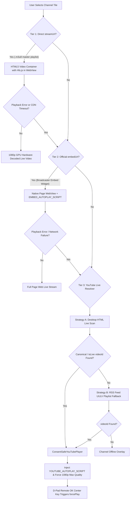

# TV-NewsHub Stream Resolver & Fallback Architecture Guide

> **Version**: `v0.0.5`  
> **Target OS**: Android TV | Google TV | Fire TV  
> **Goal**: 100% Stream Availability & Maximum Video Quality Across All Channels  

---

## 🏗️ 3-Tier Resolution & Dynamic Fallback Hierarchy

TV-NewsHub employs a robust 3-tier fallback architecture designed to guarantee **100% video stream uptime** with maximum available video quality (1080p Full HD).

---

## 📺 Tier Technical Deep-Dive

### 1. Tier 1: Direct HLS Stream (`streamUrl`)
* **Primary Technology**: Akamai / CloudFront HLS (`.m3u8` master playlists).
* **Renderer**: `<video>` HTML5 player container with `Hls.js` inside `react-native-webview`.
* **Max Quality Enforcement**:
  * `capLevelToPlayerSize: false` — prevents WebView container logical bounds from downscaling quality.
  * `hls.currentLevel = hls.levels.length - 1` — locks stream directly to the top 1080p Full HD bitrate.
  * `maxBufferLength: 60` & `maxBufferSize: 60MB` — pre-buffers up to 1 minute of video to prevent buffering stutter on TV Wi-Fi.

### 2. Tier 2: Official Embed Player (`embedUrl`)
* **Primary Technology**: Broadcaster's official live web widgets (e.g. `zeenews.india.com`).
* **Renderer**: Direct WebView URL source (bypasses CORS iframe boundaries).
* **Auto-Play & Control Engine**:
  * `EMBED_AUTOPLAY_SCRIPT`: Scans for 16+ player button selectors (VideoJS, JWPlayer, Brightcove, YouTube) every 500ms for 20 seconds.
  * Uses DOM `MutationObserver` to click lazy-loaded play buttons dynamically as soon as they mount.
  * D-Pad OK / Center key injects `EMBED_FORCE_PLAY_SCRIPT` to unmute and trigger `.play()` on all `<video>` tags.

### 3. Tier 3: YouTube Live Stream Resolver (`youtubeChannelId`)
* **Primary Technology**: Live channel ID resolution + `react-native-youtube-iframe`.
* **Resolution Pipeline**:
  1. **Strategy A**: Scans `https://www.youtube.com/channel/<ID>/live` using a Desktop User-Agent with 3 pattern matchers (`canonical`, `isLive:true`, `liveStreamabilityRenderer`).
  2. **Strategy B**: If HTML parsing is blocked, falls back to `https://www.youtube.com/feeds/videos.xml?playlist_id=UULV...` RSS feed.
* **Consent & Quality Injection**:
  * `ConsentSafeYouTubePlayer` sets persistent Layer 1 `CONSENT=YES+` cookies.
  * Injects `YOUTUBE_AUTOPLAY_SCRIPT` to click the YouTube red play button and set quality to `hd1080` via YouTube's HTML5 API.
  * Exposes `forcePlay()` via `forwardRef` so D-Pad OK center clicks force immediate playback.

---

## ⚡ Dynamic Runtime Fallback (100% Success Guarantee)

If a channel has both a primary source (`streamUrl` or `embedUrl`) AND a `youtubeChannelId`:

1. The app first attempts to load the primary Tier 1 or Tier 2 stream.
2. If the primary stream encounters a network error, HTTP 403, or invalid manifest (`onError`), `PlayerScreen` dynamically switches `useYoutubeFallback` to `true`.
3. The app seamlessly falls back to Tier 3 (YouTube Live Resolver) without exiting the player screen!
4. Only if both Primary AND YouTube fallback fail does the app display the 5-second auto-return offline overlay.

---

## 🎮 TV Remote D-Pad Navigation Rules

| D-Pad Input | Action |
| :--- | :--- |
| **OK / Center** | Forces video playback (`forcePlay()`) & toggles control overlay |
| **LEFT D-Pad** | Switches to previous channel in list |
| **RIGHT D-Pad** | Switches to next channel in list |
| **DOWN D-Pad** | Shows translucent player control overlay |
| **UP D-Pad** | Hides translucent player control overlay |
| **BACK Key** | Navigates back to Home channel grid with focus retention |
